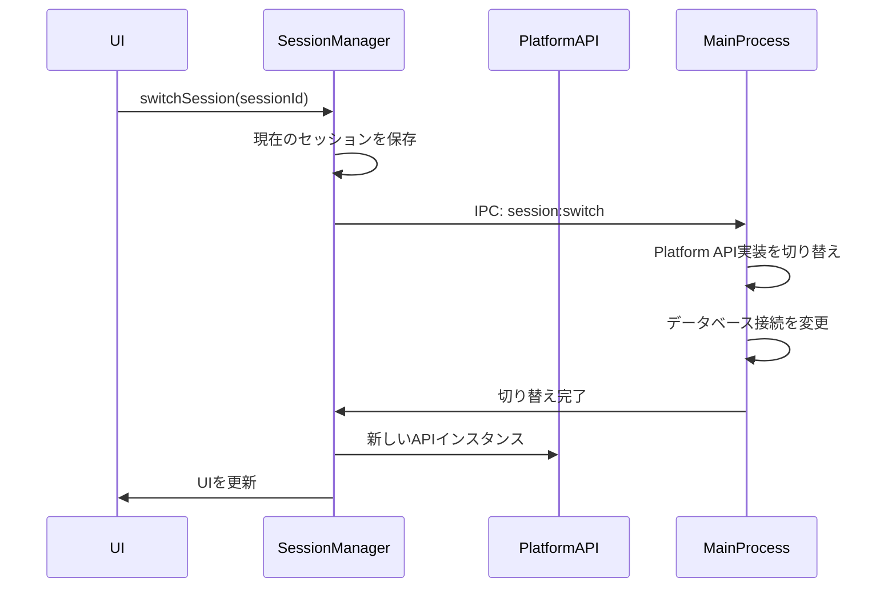

# チーム向け機能設計書

## 概要

現在のローカル動作のMCP Routerを、チーム向けに外部APIサーバーと接続できるよう拡張する。Chromeのプロファイル切り替えのように、ローカルセッションとリモートセッションを簡単に切り替えられるUIを提供する。

## アーキテクチャ

### セッション管理

#### セッションタイプ

1. **ローカルセッション**
   - SQLiteデータベース使用
   - ローカルMCPサーバー管理
   - 既存の動作を維持
2. **リモートセッション**
   - 外部APIエンドポイントに接続
   - チーム共有設定
   - 認証必須

#### セッションデータ構造

```typescript
interface Session {
  id: string;
  name: string;
  type: "local" | "remote";
  isActive: boolean;
  createdAt: Date;
  lastUsedAt: Date;

  // ローカルセッション用
  localConfig?: {
    databasePath: string;
  };

  // リモートセッション用
  remoteConfig?: {
    apiUrl: string;
    authToken?: string;
    teamId?: string;
    userId?: string;
  };

  // UI表示用
  displayInfo: {
    avatarUrl?: string;
    email?: string;
    teamName?: string;
  };
}

interface SessionState {
  sessions: Session[];
  activeSessionId: string;
  isTransitioning: boolean;
}
```

### Platform API拡張

Platform APIは既にローカル/リモートの抽象化を提供しているため、セッション切り替え時にPlatform APIの実装を動的に変更する。

```typescript
// セッション管理インターフェース
interface SessionManager {
  // セッション操作
  listSessions(): Promise<Session[]>;
  createSession(config: SessionCreateConfig): Promise<Session>;
  switchSession(sessionId: string): Promise<void>;
  deleteSession(sessionId: string): Promise<void>;
  updateSession(sessionId: string, updates: Partial<Session>): Promise<void>;

  // 現在のセッション
  getCurrentSession(): Promise<Session>;

  // Platform API切り替え
  getPlatformAPI(): PlatformAPI;
}

// セッション作成設定
interface SessionCreateConfig {
  name: string;
  type: "local" | "remote";
  remoteConfig?: {
    apiUrl: string;
    authMethod: "token" | "oauth";
    credentials?: any;
  };
}
```

### データ分離戦略

#### ワークスペース管理（既存アーキテクチャの拡張）

- **SQLiteデータベース**: ワークスペース設定をworkspacesテーブルで管理
- **safeStorage API**: 認証情報の暗号化保存
- **session API**: ワークスペースごとのCookie/認証情報分離
- **BaseService/Repository**: 既存のサービス層パターンを踏襲

#### ローカルワークスペース

- 既存のSQLiteデータベース（現在の動作を維持）
- デフォルトワークスペース: `local-default`
- 既存のテーブル構造を維持

#### リモートワークスペース

- API通信結果: メモリキャッシュ + SQLite（必要に応じて）
- 認証トークン: `safeStorage.encryptString()`で暗号化してDB保存
- セッションCookie: `session.fromPartition()`で分離
- Platform APIの実装を動的に切り替え

### セッション切り替えフロー



## UI/UX設計

### Titlebarの拡張

```
[Traffic Lights] [App Title]                    [Session Switcher ▼] [Window Controls]
                                                   ┌─────────────┐
                                                   │ 👤 User Name│
                                                   └─────────────┘
```

#### セッションスイッチャーコンポーネント

```typescript
interface SessionSwitcherProps {
  currentSession: Session;
  sessions: Session[];
  onSwitch: (sessionId: string) => void;
  onAddSession: () => void;
  onManageSessions: () => void;
}
```

#### ドロップダウンメニュー構造

```
┌─────────────────────────────┐
│ ✓ 個人用（ローカル）          │
│   リモートチーム A           │
│   リモートチーム B           │
├─────────────────────────────┤
│ ＋ 新しいセッションを追加     │
│ ⚙️ セッションを管理          │
└─────────────────────────────┘
```

### 新規セッション追加ダイアログ

```
┌─────────────────────────────────────┐
│        新しいセッションを追加          │
├─────────────────────────────────────┤
│                                     │
│ セッション名: [_______________]      │
│                                     │
│ タイプ:                             │
│ ○ ローカル（個人用）                 │
│ ● リモート（チーム用）               │
│                                     │
│ API URL: [___________________]      │
│                                     │
│ 認証方法:                           │
│ ○ APIトークン                      │
│ ○ OAuth (Google/GitHub)            │
│                                     │
│        [キャンセル] [接続]           │
└─────────────────────────────────────┘
```

## 実装アーキテクチャ（既存構造の拡張）

### セッション管理サービスの実装

```typescript
// src/main/services/workspace-service.ts
import { BaseService } from "./base-service";
import { Singleton } from "../../lib/utils/backend/singleton";
import {
  WorkspaceRepository,
  getWorkspaceRepository,
} from "../../lib/database";
import { safeStorage, session } from "electron";

export interface Workspace {
  id: string;
  name: string;
  type: "local" | "remote";
  isActive: boolean;
  createdAt: Date;
  lastUsedAt: Date;
  remoteConfig?: {
    apiUrl: string;
    authToken?: string; // 暗号化して保存
    teamId?: string;
    userId?: string;
  };
  displayInfo?: {
    avatarUrl?: string;
    email?: string;
    teamName?: string;
  };
}

export class WorkspaceService
  extends BaseService<Workspace, string>
  implements Singleton<WorkspaceService>
{
  private static instance: WorkspaceService | null = null;
  private electronSessions: Map<string, Electron.Session> = new Map();
  private repository: WorkspaceRepository;

  public static getInstance(): WorkspaceService {
    if (!WorkspaceService.instance) {
      WorkspaceService.instance = new WorkspaceService();
    }
    return WorkspaceService.instance;
  }

  private constructor() {
    super();
    this.repository = getWorkspaceRepository();
  }

  protected getEntityName(): string {
    return "ワークスペース";
  }

  // 認証情報の暗号化保存
  async saveWorkspaceCredentials(
    workspaceId: string,
    token: string,
  ): Promise<void> {
    if (safeStorage.isEncryptionAvailable()) {
      const encrypted = safeStorage.encryptString(token);
      await this.repository.updateCredentials(workspaceId, encrypted);
    }
  }

  // セッションの分離
  getIsolatedSession(workspaceId: string): Electron.Session {
    if (!this.electronSessions.has(workspaceId)) {
      const partition = `persist:workspace-${workspaceId}`;
      const isolatedSession = session.fromPartition(partition);
      this.electronSessions.set(workspaceId, isolatedSession);
    }
    return this.electronSessions.get(workspaceId)!;
  }

  // ワークスペース切り替え
  async switchWorkspace(workspaceId: string): Promise<void> {
    await this.repository.setActiveWorkspace(workspaceId);
    // Platform APIの切り替えをトリガー
    this.emit("workspace-switched", workspaceId);
  }
}
```

### データベース拡張

```typescript
// src/lib/database/repositories/workspace-repository.ts
import { BaseRepository } from "./base-repository";
import { Workspace } from "../../../main/services/workspace-service";

export class WorkspaceRepository extends BaseRepository<Workspace> {
  protected tableName = "workspaces";

  constructor(db: SqliteManager) {
    super(db);
    this.initializeDefaultWorkspace();
  }

  // デフォルトのローカルワークスペースを作成
  private initializeDefaultWorkspace(): void {
    const defaultWorkspace = this.findOne("type = ?", ["local"]);
    if (!defaultWorkspace) {
      this.create({
        id: "local-default",
        name: "ローカル",
        type: "local",
        isActive: true,
        createdAt: new Date(),
        lastUsedAt: new Date(),
      });
    }
  }

  // アクティブワークスペースを取得
  getActiveWorkspace(): Workspace | null {
    return this.findOne("isActive = ?", [1]);
  }

  // ワークスペースを切り替え
  setActiveWorkspace(workspaceId: string): void {
    this.db.transaction(() => {
      // 全てのワークスペースを非アクティブに
      this.db.prepare("UPDATE workspaces SET isActive = 0").run();
      // 指定されたワークスペースをアクティブに
      this.db
        .prepare(
          "UPDATE workspaces SET isActive = 1, lastUsedAt = ? WHERE id = ?",
        )
        .run(new Date().toISOString(), workspaceId);
    })();
  }

  // 暗号化された認証情報を更新
  updateCredentials(workspaceId: string, encryptedToken: Buffer): void {
    this.db
      .prepare(
        "UPDATE workspaces SET remoteConfig = json_set(remoteConfig, '$.authToken', ?) WHERE id = ?",
      )
      .run(encryptedToken.toString("base64"), workspaceId);
  }
}
```

### マイグレーション

```sql
-- migrations/008_add_workspaces.sql
CREATE TABLE IF NOT EXISTS workspaces (
  id TEXT PRIMARY KEY,
  name TEXT NOT NULL,
  type TEXT NOT NULL CHECK(type IN ('local', 'remote')),
  isActive INTEGER NOT NULL DEFAULT 0,
  createdAt TEXT NOT NULL,
  lastUsedAt TEXT NOT NULL,
  remoteConfig TEXT, -- JSON
  displayInfo TEXT   -- JSON
);

-- デフォルトのローカルワークスペース
INSERT INTO workspaces (id, name, type, isActive, createdAt, lastUsedAt)
VALUES ('local-default', 'ローカル', 'local', 1, datetime('now'), datetime('now'));
```

### IPC通信拡張

```typescript
// src/main/handlers/workspace-handlers.ts
export function registerWorkspaceHandlers() {
  // ワークスペース一覧取得
  ipcMain.handle("workspace:list", async () => {
    return getWorkspaceService().list();
  });

  // ワークスペース作成
  ipcMain.handle(
    "workspace:create",
    async (_, config: WorkspaceCreateConfig) => {
      return getWorkspaceService().create(config);
    },
  );

  // ワークスペース切り替え
  ipcMain.handle("workspace:switch", async (_, workspaceId: string) => {
    await getWorkspaceService().switchWorkspace(workspaceId);
    // Platform APIを再初期化
    await reinitializePlatformAPI(workspaceId);
  });

  // 現在のワークスペース取得
  ipcMain.handle("workspace:current", async () => {
    return getWorkspaceService().getActiveWorkspace();
  });
}
```

### Platform API切り替え実装

```typescript
// src/main/platform-api-manager.ts
class PlatformAPIManager {
  private currentAPI: PlatformAPI | null = null;
  private currentWorkspaceId: string | null = null;

  async initialize(workspaceId: string): Promise<void> {
    const workspace = await getWorkspaceService().findById(workspaceId);

    if (workspace.type === "local") {
      // 既存のローカル実装を使用
      this.currentAPI = createLocalPlatformAPI();
    } else {
      // リモートAPI実装を使用
      this.currentAPI = createRemotePlatformAPI(workspace.remoteConfig);
    }

    this.currentWorkspaceId = workspaceId;
  }

  getCurrentAPI(): PlatformAPI {
    if (!this.currentAPI) {
      throw new Error("Platform API not initialized");
    }
    return this.currentAPI;
  }
}
```

## 実装フェーズ

### Phase 1: 基盤構築（1週間）

1. WorkspaceService/Repositoryの実装
2. データベースマイグレーション追加
3. IPC通信ハンドラーの実装
4. Platform API切り替え機構の実装

### Phase 2: UI実装（1週間）

1. Titlebarコンポーネントの拡張
2. セッションスイッチャーUI
3. 新規セッション追加ダイアログ
4. セッション管理画面

### Phase 3: Platform API統合（1週間）

1. セッションベースのPlatform API切り替え
2. リモートAPI実装の作成
3. 認証フローの実装
4. エラーハンドリング

### Phase 4: データ管理（3-4日）

1. セッションごとのデータ分離
2. キャッシュ戦略の実装
3. オフライン対応
4. データ同期機能

### Phase 5: テストと最適化（3-4日）

1. 統合テスト
2. パフォーマンス最適化
3. エラーハンドリング強化
4. ドキュメント作成

## セキュリティ考慮事項

1. **認証情報の保護**
   - `safeStorage.encryptString()` / `safeStorage.decryptString()`使用
   - macOS: Keychain、Windows: DPAPI、Linux: libsecret統合
   - メモリ上での認証情報の最小化
2. **セッション分離**
   - `session.fromPartition()`でセッションごとにCookie、キャッシュ、認証を分離
   - webContentsのセッション隔離
   - セッション間のデータ漏洩防止
3. **通信セキュリティ**
   - HTTPS必須
   - 証明書検証（`app.on('certificate-error')`でのハンドリング）
   - CSPヘッダーの適切な設定
4. **ローカルデータ保護**
   - electron-storeの暗号化オプション使用
   - アプリケーションサンドボックス内でのデータ保存
   - 適切なファイルパーミッション設定

## 技術的制約と解決策

### 制約

1. Electron単一プロセスでの複数セッション管理
2. メモリ使用量の増加（複数セッションのキャッシュ）
3. セッション切り替え時のレイテンシ

### 解決策

1. セッションパーティション（`session.fromPartition()`）の効率的な管理
2. 非アクティブセッションのガベージコレクション
3. electron-storeでの軽量なメタデータ管理とオンデマンドロード

## 将来の拡張性

1. **マルチウィンドウ対応**
   - セッションごとの独立ウィンドウ
2. **同期機能**
   - ローカル↔リモート間の設定同期
3. **権限管理**
   - チーム内での役割ベースアクセス制御
4. **監査ログ**
   - セッション活動の記録
